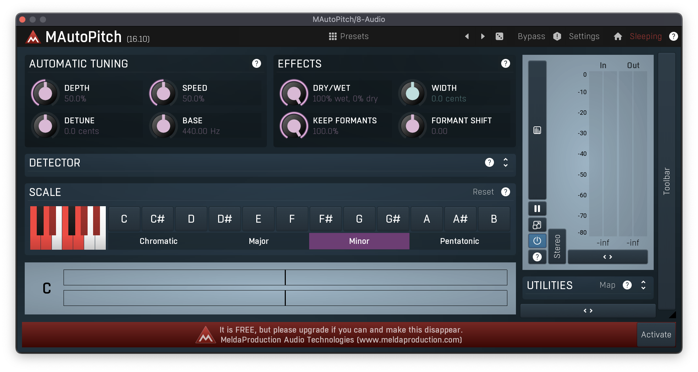
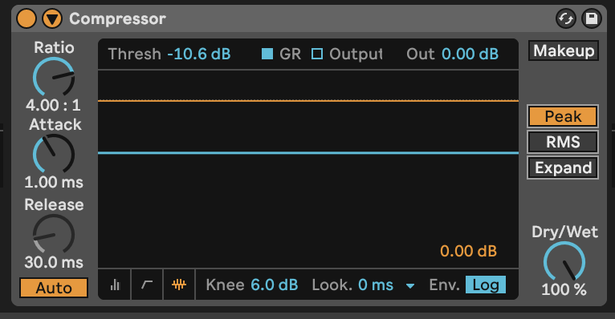
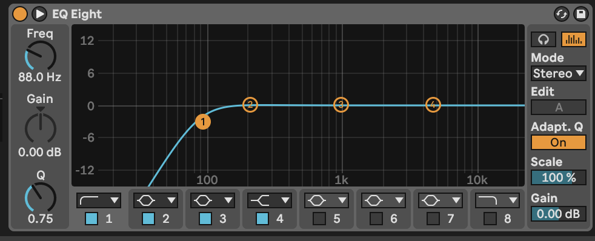
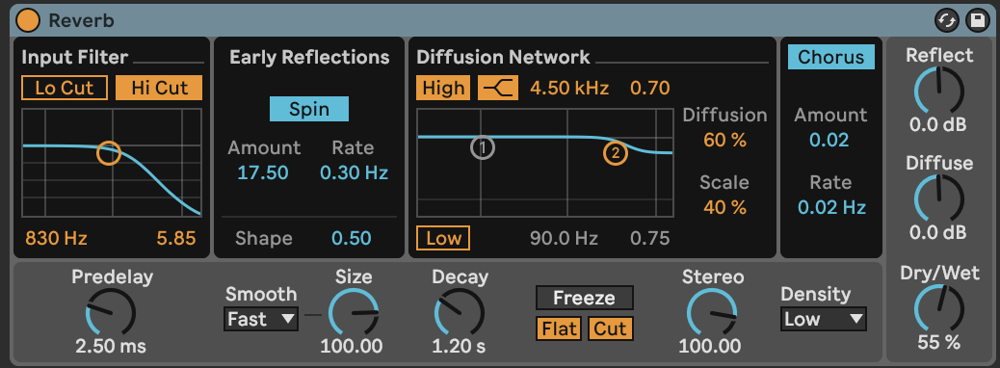
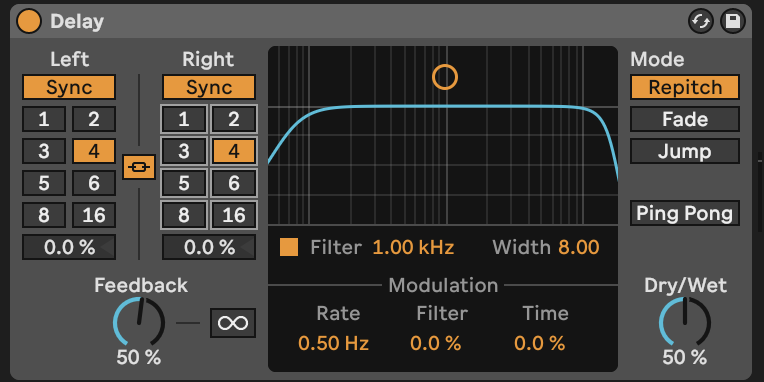
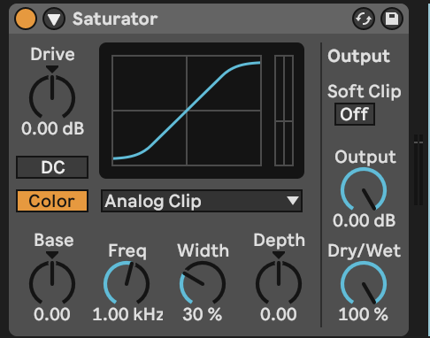

# INFO492 B - Recording and Mixing Lab

## Overview
In this lab, we will be going over audio processing and mixing, and recording with an audio interface. Not everything in this readme needs to be completed in class today; use this as a guide you can reference when producing/mixing your tracks.

## Audio Interface Setup
- On Windows, download Focusrite Control
- Connect the audio interface and open Ableton
- Open the preferences by pressing `Command + ,` on Mac or `Control + ,` on Windows
- Windows Users
    - Under `Audio` settings, change the `Driver Type` to ASIO and set the driver to Focusrite USB ASIO.
- Mac Users
    - Under `Audio` settings, change the Audio Input and Output devices to Focusrite 2i2.
 - Plug the mic in and ensure that `48V` is turned on.
 - Set the gain knob for that input somewhere in the middle. Avoid clipping when recording dry signals.
 - Create a new Audio track in Ableton
 - Set the audio track input to either 1 or 2 (whichever input is plugged into the Focusrite Audio Interface). Notice the input volume level changing in real-time with the audio signal (if configured correctly).
 - Click the button furthest to the right on the track to arm it for recording.
 - 
 - Change the track mode from `Off` or `Auto` to `In` to hear playback from the mic input. Change this back if you would like to hear track audio again.

## Free Plugins

A curated list of free plugins that are compatible with both Ableton Suite and Lite versions. These plugins will help you in tuning, sampling, effects, and expanding your instrument library.  

> Note: Downloading any of these plugins is optional. Some of these may be helpful during production but not required. If you have to pick a couple to download, I would recommend installing MAutoPitch and MEqualizer (if you don't have the stock EQ 8 in Ableton)

### Text to Sample

- [TextToSample | Samplab](https://samplab.com/text-to-sample): Transform text into unique samples using AI.
- Also does Audio-to-Audio generation
- I could not get working on my Mac (although it says it should), works on Windows

### FX

- [MeldaProduction Free Plugin Installer](https://www.meldaproduction.com/downloads): A comprehensive collection of free effect plugins (includes Melda AutoPitch)

### HQ Instrument Sample Library

- [Spitfire Audio LABS](https://labs.spitfireaudio.com/): High-quality instrument samples to enhance your music production, great variety.

### Autotune

- [Graillon Free Autotune](https://www.auburnsounds.com/products/Graillon.html): A versatile plugin for pitch correction and vocal effects.

### Ableton MagentaStudio Max for Live Plugin
- Note that this will only work on those using the Ableton Trial; those who purchase the Intro version will not be able to use this due to the Intro version not having Max4Live.

- [MagentaStudio](https://magenta.tensorflow.org/studio/ableton-live/)

## Generating Audio

In your ensembles, get together and work to generate sample audio that you would like to use using an AI agent of your choice. Get creative and go through multiple iterations until you find one that stands out. After that, proceed to the rest of the lab.

## Getting Audio into the DAW / Working with your track

### Finding the sample BPM & key

We start by detecting the BPM (Beats Per Minute) of your audio samples. This is crucial for aligning the sample rhythmically with your Ableton project. We'll use online tools for BPM detection and demonstrate how to manually adjust the tempo in Ableton.

- [Song Key and BPM Finder - Voice.ai](https://voice.ai/tools/bpm-finder)

- [Splitter AI](https://vocalremover.org/splitter-ai)

Understanding the key of your sample is essential for harmonic mixing. We'll cover techniques to determine if your sample has root notes, follows a chord progression, or requires you to apply your own key. This knowledge will help in blending the sample harmoniously with other elements in your track.

- Does the sample have root notes?
- Does it follow a chord/bass progression or can you apply your own?
    - Depending on what element you are hoping the AI part will fill, it may or may not need one.
    - Example: If you are looking for a guitar solo, and it records a guitar chord section with bass notes, it’s probably best to generate another output and tweak your prompt rather than EQing it later.

### Fitting it into your track

**Mixing Chart** (use as guidelines for fitting your tracks into the mix; do not use this 100% literally! Mix based on your track as it is)

## Processing Audio: Vocals

Processing vocals effectively is crucial in music production. A well-processed vocal track can elevate your music, providing clarity, warmth, and presence. Here, we'll break down the vocal processing chain into key steps and explore techniques suitable for various vocal recordings. 

> Note that the order in which you add these effects matters! The audio effects process the input signal sequentially from left to right.

### Step 1: Tuning

Before polishing your vocals, you should generally take care of tuning them. In most cases, selecting the right key and dialing the retune speed knob to taste is just easy, quick, and perfectly sufficient.

- **Purpose:** 
  - Correct pitch inaccuracies and enhance the tonal quality of the vocal.
- **Tools:** 
  - Use free plugins like Melda AutoPitch or Graillon Free Autotune. 
  - There is no Ableton stock autotune.
- **Tips:** 
  - Set the autotune to the key of your song and adjust the pitch adjustment time knob to set the speed of the auto-adjustment.
  - Aim for a natural-sounding correction. Over-tuning can result in an artificial, 'robotic' sound unless that's the desired effect.

### Step 2: Gating

A gate plugin serves as an efficient tool for minimizing background noise in vocal tracks. While some prefer manually editing their audio by removing non-vocal sections for greater control, utilizing a gate can be a more straightforward and quicker alternative during mixing.

Operating a gate might seem daunting, but it's surprisingly straightforward. For most gate plugins, the key adjustment is the threshold setting. This threshold determines the dB level at which the gate activates. Sounds above this level are allowed through, while those below are silenced. For instance, if your vocal is clear at -12dB and the background noise is around -48dB, setting the gate threshold between -20dB to -30dB is effective.

Furthermore, many gate plugins offer visual aids to help you easily identify and set the appropriate threshold values.

- **Purpose:** Eliminate background noise and unwanted breath sounds between phrases.
  - **How to:** Set the gate threshold to cut off the noise but don't affect the vocal parts. Take note of the lowest DB level of audio you want to keep and set your gate threshold below it to remove the unimportant audio information below this DB level.
- **Consideration:** 
  - Be careful not to set the threshold too high, as it might cut off softer parts of the vocal.
- **Tools:** 
  - Use Ableton Stock Gate
  - 

### Step 3: De-Essing (DS)

- **Purpose:** Reduce the prominence of 'sibilant' sounds (like "s" and "sh") that can be harsh on the ears.
- **Method:** Use a de-esser plugin to selectively compress these frequencies.
- **Attention:** Adjust the frequency range and threshold carefully to avoid dulling the overall vocal brightness.
- **Tools:**

[T-De-Esser VST Plugin - Free Download](https://www.bestfreeplugins.com/plugin/T-De-Esser.php)

### Step 4: Equalization (EQ)

As a general rule of thumb, you want to start with a high-pass filter first. This will remove any low-end rumble or muddiness that might be present in your vocal. The cutoff frequency will depend on the recording but is usually between 80Hz and 100Hz.

After that, you can lower a few other frequency areas by -1 to -2dB. What to lower always depends on the vocal, the vocalist, the recording setup, the mic, and many other factors. So when you mix vocals, try giving your vocal a closer listen and slightly lower the frequency areas that you find to be a little too “present” and don’t want to intensify later.

- Consider the instrument that you are trying to emulate with AI;
    - What frequencies would this instrument be filling in a natural recording setting?
    - To control the sample further, try to find the critical frequencies that this sound fills. IEL The sound might contain low-end frequencies, but we  want to cut those if this is not intended to be a bass instrument.
- Then, apply an EQ and make basic adjustments. Don't overdo it.
    - Start with a high-pass filter
    - 

- **Goal:** Balance the vocal frequencies and make them sit well in the mix.
- **Subtractive EQ:** Start by cutting unnecessary frequencies, typically the low end, to reduce muddiness.
- **Additive EQ:** Gently boost frequencies to enhance clarity or presence if needed (be careful not to overdo it)
- **Tips:** 
  - Use a parametric EQ for precise control (i.e., the tools listed below!)
    - Subtractive EQ is much more powerful than Additive EQ.
    - Instead of boosting the frequencies that you want to be highlighted, reduce the frequencies that you do not wish to and then slightly increase the audio (or mix it however it sounds good)
    - This is because the frequencies you want to highlight should already be present in the sound; you shouldn’t be trying to force a sound to be something it’s not.
- **Tools**: 
  - Ableton EQ 8
  - Melda Equalizer

### Step 5: Compression

- **Objective:** Control the dynamic range, ensuring the vocals are consistently present and blend well with the track.
- **Settings:** 
    - Use a moderate ratio (2:1 or 4:1) and threshold to avoid over-compression. 
    - Set your threshold to a db level slightly above the average vocal level (in dB). Essentially, you want to control the peaks so that they are not too loud but not compressing everything and taking the life away from the vocal. 
    - Adjust the attack and release to suit the vocal style and tempo of the track.
    - 
- **Note:** 
  - Compression can also add character to the vocal, so experiment with different compressor types and parameters.
- **Tools:** 
  - Ableton Stock Compressor

### Step 6: Additional Effects (Optional)

- **Reverb:** Adds space and depth. Use it sparingly to avoid washing out the vocal.
    - Use Ableton Stock Reverb
    - 
- **Delay:** Can enhance the vocal track's rhythm and texture. Sync the delay time with the track's tempo for coherence. I recommend 
    - Use Ableton Stock Delay
    - 
    - Change the delay time to fit your track. 
    - Change the mode to set the style of delay
- **Saturation:** A touch of saturation can add warmth and help vocals cut through the mix.
    - Ableton Stock Saturator
    - 

### Mixing in Context

- **Balance:** Continuously refer back to the full mix to ensure the vocals blend harmoniously with other elements.
- **Automation:** 
  - Use volume automation to fine-tune the vocal dynamics throughout the track.
    - Activate automation channels by pressing ‘a’. Make sure that your keyboard is not set as a midi device in Ableton (the highlighted button below in the top bar)
    
    - You can automate most parameters within Ableton, so get creative. 

### Practice and Experimentation

- **Listening:** 
  - Pay attention to professionally mixed tracks and analyze how the vocals are processed.
  - Use AI song stem splitters to get a more detailed look into your reference tracks.
- **Experiment:** Try different processing chains and settings to understand their impact on various vocal recordings. 
  - Different vocal styles will have vastly different vocal chains. 
  - If you have a specific style in mind, I recommend looking up tutorials on how to recreate that artist's vocal chain.
 
### Questions
Music production has a steep learning curve and can be frustrating, so feel free to reach out on Discord with any signal flow/production/mixing questions before overthinking things!

